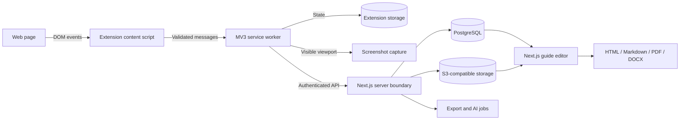

# Capchur Development Playbook

This is the global reference for developing Capchur across separate VS Code and Copilot sessions. It combines the product roadmap, architecture, command sequence, acceptance criteria, and progress tracker.

Every contributor and coding agent must read the **Current State**, **Architecture Rules**, and active session before generating code. Update this document when a session changes architecture, contracts, setup, commands, or milestone status.

## How To Use This Document

You do not need coding experience to follow this process.

1. Open the `Capchur` folder in VS Code.
2. Open this file and find the first session marked `NEXT`.
3. Run the commands listed under **Start Every Coding Session**.
4. Ask Copilot to complete only that session, using the supplied prompt.
5. Test the acceptance checklist yourself.
6. Run the commands under **Finish Every Coding Session**.
7. Change the session status only after all acceptance checks pass.

Use these status words consistently:

- `DONE`: implemented, tested, and committed.
- `NEXT`: the only planned session that should begin now.
- `BLOCKED`: cannot continue; record the reason in **Decision Log**.
- `PLANNED`: intentionally not started.

Do not mark a session `DONE` because code exists. Its acceptance checks and validation commands must pass.

## Current State

**Current milestone:** `S15 - AI description enhancement`

**Current repository status:** Runtime-validated capture and guide contracts, persistent recording state, popup controls, pure element analysis, approved-page click capture, visible-tab screenshots, local session review, a responsive web guide editor, trusted persistence APIs, database-backed workspace authentication, resilient extension-to-cloud session sync, and HTML, Markdown, PDF, and DOCX exports are implemented with focused Vitest coverage. Development persists PostgreSQL-compatible data and private objects locally; production adapters target PostgreSQL and S3-compatible storage.

**Last completed session:** `S14 - PDF and DOCX export`

**Next action:** Complete S15 only. Add optional server-side AI description enhancement with sanitized inputs and deterministic fallback.

## Product Goal

Capchur records a user's browser workflow and turns it into an editable guide containing:

- A sequence of meaningful user actions.
- Automatically generated step descriptions.
- A screenshot for each action.
- A movable highlight around the target element.
- Editing, reordering, deletion, cropping, and redaction.
- Private sharing and team collaboration.
- HTML, Markdown, PDF, and DOCX exports.

The first releasable milestone is narrower: record five browser clicks, retain them after reload, show accurate descriptions and highlights, edit the guide, and export it.

## System Architecture



### Repository Ownership

| Location                       | Owns                                                                                     | Must not own                                                   |
| ------------------------------ | ---------------------------------------------------------------------------------------- | -------------------------------------------------------------- |
| `apps/extension`               | Browser events, permissions, extension lifecycle, screenshots, local queue, extension UI | Database implementation, server secrets, web editor components |
| `apps/web`                     | Guide editor, trusted API boundaries, authentication, server workflows                   | Browser extension APIs or content-script implementation        |
| `packages/contracts`           | Versioned messages and data exchanged between processes/apps                             | Browser, React, database, or framework implementation          |
| Future `packages/capture-core` | Pure element analysis and description rules                                              | DOM event registration or extension APIs                       |
| `packages/export-core`         | Pure guide-to-document transformations and portable HTML/Markdown bundles                | UI, authentication, or storage clients                         |

Dependencies flow from applications toward shared packages. An application must never import code from another application.

### End-To-End Data Flow

1. The popup asks the service worker to start a recording session.
2. The service worker persists recording state before replying.
3. The content script observes supported user actions only while recording.
4. Pure capture logic converts an untrusted DOM element into sanitized metadata.
5. The content script sends a validated, versioned message to the service worker.
6. The service worker captures the visible tab and stores the step atomically.
7. Local steps upload through an authenticated API when cloud sync is available.
8. The web editor loads guide data through its server boundary.
9. Export logic consumes the same guide contract used by the editor.

## Architecture Rules

These rules apply to every development session.

1. **Contract first:** Define or update shared data and message contracts before changing producers and consumers. Update both sides in the same session.
2. **Validate boundaries:** Page DOM, extension messages, storage, URLs, API input, imported files, and AI output are untrusted.
3. **Persist important state:** Never rely on Manifest V3 service-worker memory. Recording state and accepted steps must survive suspension.
4. **Separate logic from frameworks:** Element naming, selector generation, guide transformations, and export mapping should be pure functions with tests.
5. **Store annotations separately:** Keep screenshots unchanged. Store highlight rectangles, crop settings, and redactions as metadata until export.
6. **Minimize permissions:** Add a browser permission only in the session that needs it, document why, and test denied permission behavior.
7. **Protect sensitive data:** Never capture password values, payment values, secrets, authentication data, or full private page payloads in logs.
8. **Keep server secrets server-side:** API keys, database credentials, and storage credentials must never enter extension or client bundles.
9. **No silent failures:** User-facing flows require loading, empty, error, denied, and retry states.
10. **No isolated feature completion:** A cross-boundary feature is complete only when its contract, producer, consumer, tests, documentation, and migration impact are handled together.

## Technology Baseline

Do not replace these choices without recording an architecture decision.

- Workspace: pnpm 11 through `corepack pnpm`.
- Language: strict TypeScript.
- Extension: WXT, React, Manifest V3, WebExtension APIs.
- Web: Next.js App Router, React, Tailwind CSS.
- Shared validation: choose and add one schema library in S01; use inferred TypeScript types from schemas at runtime boundaries.
- Unit tests: Vitest.
- Browser and workflow tests: Playwright.
- Database phase: PostgreSQL with Drizzle ORM unless an architecture decision changes it.
- Object storage phase: S3-compatible storage with development adapter.
- Background jobs phase: a durable queue, introduced only when exports or AI need it.

## Commands

Run all commands from the repository root, `D:\BizLeader\AI\Capchur`.

### One-Time Setup On A New Computer

Open one VS Code PowerShell terminal and run these commands in order:

```powershell
node --version
corepack --version
git --version
corepack pnpm install
corepack pnpm run install:pdf-browser
corepack pnpm run typecheck
corepack pnpm run lint
corepack pnpm run build
```

Expected minimum Node version: 22. Do not use `npm install`, create nested lockfiles, or run forceful audit fixes.

### Start Every Coding Session

Use a new Copilot chat for one roadmap session. In the VS Code terminal, run:

```powershell
git status --short
git pull --ff-only
corepack pnpm install --frozen-lockfile
corepack pnpm run typecheck
corepack pnpm run lint
```

If `git status --short` shows files you do not recognize, stop and ask Copilot to inspect them. Do not delete or reset them.

Copy this message into the new Copilot chat, replacing `SXX`:

```text
Read .github/copilot-instructions.md and docs/DEVELOPMENT_PLAYBOOK.md first.
Implement only session SXX from the playbook. Respect repository ownership and
contract-first rules. Update tests and the playbook progress/decision log. Run
the required validation, but do not commit until I ask.
```

### Run Both Applications

Keep these in two separate VS Code terminals while manually testing.

**Terminal 1 - web editor:**

```powershell
corepack pnpm run dev:web
```

Open http://localhost:3000.

**Terminal 2 - browser extension:**

```powershell
corepack pnpm run dev:extension
```

WXT opens a development Chrome profile. Its development server uses http://localhost:3001. Test the extension in the Chrome profile WXT opens, not your normal browser profile.

Stop a running development server by clicking its terminal and pressing `Ctrl+C` once.

### Finish Every Coding Session

Run these in order:

```powershell
corepack pnpm run test
corepack pnpm run typecheck
corepack pnpm run lint
corepack pnpm run build
git status --short
git diff --stat
```

For dependency changes, also run:

```powershell
corepack pnpm audit --audit-level high
```

An audit finding is not permission to run `--force`. Record unresolved findings in **Known Risks**.

After the acceptance checks pass, ask Copilot:

```text
Update docs/DEVELOPMENT_PLAYBOOK.md to mark the active session DONE and the next
session NEXT. Summarize validation and inspect the staged files for secrets or
generated output. Then commit this session with a concise conventional commit.
```

Do not push unless a remote repository has been configured and you intend to publish the work.

## Development Roadmap

### S00 - Workspace Setup

**Status:** `DONE`

**Outcome:** Runnable WXT extension, Next.js app, shared package, pnpm workspace, VS Code tasks, and root Git repository.

**Evidence:** Commit `d7a0774` (`chore: scaffold Capchur workspace`).

### S01 - Test And Contract Foundation

**Status:** `DONE`

**Goal:** Establish versioned runtime-validated contracts and focused test infrastructure before browser behavior is added.

**Tasks:**

- [x] Add one runtime schema library to `packages/contracts`.
- [x] Define schemas and inferred types for recording session, step, element metadata, viewport, screenshot metadata, and highlight metadata.
- [x] Define versioned request, response, and event message schemas.
- [x] Add Vitest to contracts and extension packages.
- [x] Test valid and invalid messages and sensitive-field rejection rules.
- [x] Add root `test` and focused package test scripts.
- [x] Update this playbook if actual commands differ.

**Acceptance:** Invalid messages are rejected at runtime; shared types compile in both apps; tests fail when a required contract field is removed.

**Validation evidence:** Contracts tests passed (9), extension tests passed (2), typecheck passed across contracts and both applications, lint passed, and both production builds passed. The required dependency audit ran and reported the existing toolchain advisories recorded under **Known Risks**.

### S02 - Recording State Machine

**Status:** `DONE`

**Goal:** Start, stop, resume, query, and clear a recording session without relying on service-worker memory.

**Tasks:**

- [x] Implement a pure recording state machine.
- [x] Add storage adapter around extension storage.
- [x] Handle typed start, stop, resume, status, and clear messages in the service worker.
- [x] Persist state before acknowledging commands.
- [x] Test service-worker restart and corrupted storage recovery.

**Acceptance:** Start recording, reload the extension, and observe the same recording state; clear requires explicit user action.

**Validation evidence:** Extension tests passed (6), including simulated service-worker restart, corrupted storage recovery, and mismatched clear protection. All 15 workspace tests, typecheck, lint, and production builds passed. The emitted MV3 manifest contains the required `storage` permission.

### S03 - Popup Recording Controls

**Status:** `DONE`

**Goal:** Replace starter popup UI with accessible controls connected to S02.

**Tasks:**

- [x] Build start, stop, resume, clear, and open-session commands.
- [x] Show recording status, duration, and step count.
- [x] Add loading, permission-denied, unavailable-page, and error states.
- [x] Remove generated WXT/React demo assets and styles.

**Acceptance:** Keyboard-only users can control recording; reopening the popup reflects persisted state.

**Validation evidence:** All 21 workspace tests passed, including six focused popup command, response-validation, page-availability, and duration tests. Repository typecheck, lint, and production builds passed. The emitted MV3 manifest contains only the required `activeTab` and `storage` permissions, and the popup uses native keyboard controls with visible focus states and live status/error announcements.

### S04 - Element Analysis Core

**Status:** `DONE`

**Goal:** Convert a DOM target into safe, useful metadata and a deterministic description.

**Tasks:**

- [x] Add `packages/capture-core` with pure element naming and selector logic.
- [x] Prioritize accessible name, label, text, alternative text, title, placeholder, and nearby context.
- [x] Generate multiple locator candidates without exposing them in descriptions.
- [x] Detect sensitive and unsupported elements.
- [x] Test native controls, ARIA controls, nested targets, shadow DOM paths, and missing labels.

**Acceptance:** Fixtures produce descriptions such as `Click the Save button`; passwords and sensitive values are excluded.

**Validation evidence:** All 36 workspace tests passed, including 15 capture-core fixtures for naming priority, native and ARIA controls, nested targets, deterministic locator candidates, open shadow roots, unlabeled controls, and privacy rejection. Repository typecheck, lint, and production builds passed. The dependency audit reported only the existing toolchain advisories recorded under **Known Risks**.

### S05 - Click Capture Pipeline

**Status:** `DONE`

**Goal:** Capture supported clicks from ordinary HTTP(S) pages and persist steps through validated messages.

**Tasks:**

- [x] Request the minimum host access when recording starts.
- [x] Register content scripts for approved HTTP(S) pages.
- [x] Listen in capture phase and use `event.composedPath()`.
- [x] Ignore extension UI, duplicate events, hidden targets, and unsupported pages.
- [x] Send only schema-validated metadata to the service worker.

**Acceptance:** Five clicks produce five ordered persisted steps; no events are captured while stopped.

**Validation evidence:** All 43 workspace tests passed, including composed-path targeting, hidden and extension-owned target rejection, duplicate listener prevention, sender URL validation, five-step ordering, persistence, and stopped-state gating. Repository typecheck, lint, and production builds passed. The emitted MV3 manifest contains `activeTab`, `scripting`, and `storage`, with HTTP(S) host access optional; the dependency audit reports the existing advisories under **Known Risks**.

### S06 - Screenshots And Highlights

**Status:** `DONE`

**Goal:** Attach an accurate visible-tab screenshot and editable highlight metadata to every accepted step.

**Tasks:**

- [x] Capture through the service worker with rate limiting.
- [x] Store viewport, scroll, zoom, visual viewport, and device pixel ratio.
- [x] Convert CSS coordinates to screenshot coordinates.
- [x] Keep screenshot pixels separate from highlight metadata.
- [x] Handle capture failure without losing the underlying step.

**Acceptance:** Highlights align at 100%, 125%, and 150% browser zoom and after scrolling.

**Validation evidence:** All 53 workspace tests passed, including actual-PNG dimension parsing, 100%, 125%, and 150% zoom conversion, scrolled and offset visual viewports, clipping, capture throttling, separate image storage, successful step enrichment, and screenshot-failure fallback. Repository typecheck, lint, and production builds passed with no permission or dependency changes.

### S07 - Local Session Review

**Status:** `DONE`

**Goal:** Let users inspect, rename, delete, and reorder captured steps before cloud work begins.

**Tasks:**

- [x] Add an extension review page or approved local handoff surface.
- [x] Display screenshot, description, timestamp, and target highlight.
- [x] Support edit, delete, reorder, retry screenshot, and clear.
- [x] Add session JSON export/import for debugging and recovery.

**Acceptance:** A five-step session survives browser restart and can be edited and exported as valid JSON.

**Validation evidence:** All 59 workspace tests passed, including strict review mutation contracts, persisted rename/delete/reorder operations, retry failure handling, and archive screenshot round trips. Repository typecheck, lint, and production builds passed; the WXT build emitted the new local `review.html` surface with no permission or dependency changes.

### S08 - Web Guide Editor Foundation

**Status:** `DONE`

**Goal:** Replace the Next.js starter with a responsive guide editor using shared guide contracts.

**Tasks:**

- [x] Define guide domain model separately from capture transport.
- [x] Build guide navigation, step list, selected-step editor, and media canvas.
- [x] Support local fixture loading before live API integration.
- [x] Include loading, empty, error, and unsaved states.
- [x] Add component and workflow tests.

**Acceptance:** A fixture guide can be reordered and edited on desktop and mobile without layout overlap.

**Validation evidence:** All 66 workspace tests passed, including strict guide-domain separation, immutable editor transformations, and component workflows for loading, editing, reordering, saving, empty, and error states. Repository typecheck, lint, and production builds passed. Browser checks at 1440×900 and 390×844 confirmed rendered media annotations, no horizontal overflow, and a mobile-scrollable step list without layout overlap. The dependency audit reports only the existing low-severity development-tool advisory under **Known Risks**.

### S09 - Database, Object Storage, And API

**Status:** `DONE`

**Goal:** Persist guides and images behind trusted server boundaries.

**Tasks:**

- [x] Add PostgreSQL and Drizzle schema with migrations.
- [x] Add local development storage and S3-compatible production adapter.
- [x] Define authenticated guide/session API routes with runtime validation.
- [x] Use signed upload/download flows rather than exposing credentials.
- [x] Add integration tests for authorization and transaction failures.

**Acceptance:** Create, read, update, and delete a guide; restart services; data and images remain consistent.

**Validation evidence:** All 72 workspace tests passed, including PGlite-backed guide CRUD, cross-owner isolation, transaction rollback, on-disk database restart, captured-session persistence, signed image upload/download, storage-adapter restart, and object cleanup. Drizzle migration checks, repository typecheck, lint, and production builds passed. The dependency audit reports only the existing low-severity development-server advisory under **Known Risks**.

### S10 - Authentication And Workspaces

**Status:** `DONE`

**Goal:** Add users, sessions, workspaces, and ownership authorization.

**Tasks:**

- [x] Record an architecture decision for the selected auth provider/library.
- [x] Implement sign-in, sign-out, session expiry, and protected routes.
- [x] Add workspace owner/member roles.
- [x] Enforce authorization on every server mutation and object access.

**Acceptance:** One user cannot access another workspace by changing a URL or request ID.

**Validation evidence:** All 73 workspace tests passed, including Better Auth account/session lifecycle, automatic owner workspace creation, explicit expiry and sign-out revocation, member read-only enforcement, and cross-workspace guide/session/image isolation. Repository typecheck, lint, production builds, and the high-severity dependency audit passed. Browser checks confirmed protected-route redirects, account creation, authenticated editor access, sign-out, and no horizontal overflow at 1440×900 or 390×844.

### S11 - Extension Authentication And Sync

**Status:** `DONE`

**Goal:** Securely upload local sessions and open them in the web editor.

**Tasks:**

- [x] Authenticate the extension without storing long-lived secrets in page context.
- [x] Add resumable upload queue and idempotency keys.
- [x] Map local session IDs to server guide IDs.
- [x] Add offline, retry, conflict, expired-session, and partial-upload handling.

**Acceptance:** Record offline, reconnect, upload once, and open the correct guide in the editor.

**Validation evidence:** All 79 workspace tests passed, including one-time extension authorization, hashed expiring bearer tokens, idempotent session-to-guide mapping, stale-revision conflicts, offline retries with stable keys, partial screenshot checkpoints, and expired-session preservation. Repository typecheck, lint, and production builds passed. The emitted MV3 manifest contains the required `identity` and `alarms` permissions plus only the configured web origin; browser checks confirmed the connection surface, mobile layout, protected mapped-guide URL, and sign-in redirect.

### S12 - Complete Editing And Privacy Tools

**Status:** `DONE`

**Goal:** Deliver expected guide editing tools with safe image handling.

**Tasks:**

- [x] Add manual steps, duplicate, crop, zoom, and annotation controls.
- [x] Add movable/resizable highlights.
- [x] Add irreversible export redaction and editable source redaction metadata.
- [x] Add title, introduction, section, and branding controls.
- [x] Add undo/redo and autosave conflict handling.

**Acceptance:** Users can produce a polished guide without editing raw JSON or images externally.

**Validation evidence:** All 85 workspace tests passed, including immutable manual/duplicate/delete operations, annotation geometry, crop and redaction metadata, undo/redo, and stale autosave conflict preservation. Repository typecheck, lint, database migration generation, and production builds passed.

### S13 - HTML And Markdown Export

**Status:** `DONE`

**Goal:** Establish a tested, framework-independent export model.

**Tasks:**

- [x] Add `packages/export-core`.
- [x] Map guide contracts into an export document model.
- [x] Generate accessible HTML and portable Markdown bundles.
- [x] Test escaping, image references, ordering, and redactions.

**Acceptance:** Exported documents preserve order, descriptions, images, highlights, and redactions.

**Validation evidence:** All 88 workspace tests passed, including three export-core tests for deterministic ordering, HTML/Markdown escaping, portable image references, crop translation, visible highlights, and irreversible rasterized redactions. Repository typecheck, lint, and production builds passed. The dependency audit findings are recorded under **Known Risks**.

### S14 - PDF And DOCX Export

**Status:** `DONE`

**Goal:** Generate professional PDF and Word documents through background jobs.

**Tasks:**

- [x] Add PDF rendering with Playwright.
- [x] Add DOCX generation from the export model.
- [x] Add durable job status, retry, cancellation, and expiration.
- [x] Verify page breaks, image scaling, fonts, links, and large guides.

**Acceptance:** A 50-step guide exports to valid PDF and DOCX without clipped text or missing images.

**Validation evidence:** All 95 workspace tests passed, including a real Chromium-rendered 50-step PDF parsed for page count and a 50-step DOCX validated as an OpenXML package with all 100 expected image resolutions. Durable queue restart recovery, leases, bounded retries, cancellation, expiration, artifact cleanup, workspace authorization, signed downloads, editor polling, page-break rules, image scaling, fonts, and links are covered. Repository typecheck, lint, database migration generation, and production builds passed. Desktop and mobile browser geometry checks found no toolbar overflow or overlap. The dependency audit findings remain recorded under **Known Risks**.

### S15 - AI Description Enhancement

**Status:** `NEXT`

**Goal:** Improve deterministic descriptions without making AI required for recording.

**Tasks:**

- [ ] Define sanitized AI input and structured output schemas.
- [ ] Keep provider calls on the server.
- [ ] Add opt-in controls, timeout, fallback, rate limiting, and cost tracking.
- [ ] Prevent page instructions from controlling prompts or tools.
- [ ] Test that deterministic descriptions remain available during provider failure.

**Acceptance:** AI improves ambiguous text but never receives secrets, full DOM payloads, or password/payment values.

### S16 - Sharing, Collaboration, And History

**Status:** `PLANNED`

**Goal:** Add controlled sharing and team workflows.

**Tasks:**

- [ ] Add private, workspace, and revocable-link sharing.
- [ ] Add comments and version history.
- [ ] Add optimistic concurrency or explicit conflict resolution.
- [ ] Add audit events for sensitive workspace actions.

**Acceptance:** Revoked links stop working immediately; simultaneous edits do not silently overwrite data.

### S17 - Capture Hardening And Cross-Browser Support

**Status:** `PLANNED`

**Goal:** Handle real-world browser complexity and package Chrome, Edge, and Firefox builds.

**Tasks:**

- [ ] Test navigation, multiple tabs, iframes, shadow DOM, SPAs, and delayed DOM updates.
- [ ] Define explicit behavior for canvas/WebGL and protected browser pages.
- [ ] Add input/select/submit support with privacy-safe value handling.
- [ ] Run automated extension E2E tests across supported browsers.
- [ ] Verify permission prompts and denied states.

**Acceptance:** Supported workflows pass the compatibility matrix; unsupported contexts explain limitations without data loss.

### S18 - Security, Reliability, And Release

**Status:** `PLANNED`

**Goal:** Prepare a production release with evidence.

**Tasks:**

- [ ] Threat-model extension, API, storage, sharing, exports, and AI boundaries.
- [ ] Resolve or formally accept high/critical dependency advisories.
- [ ] Add retention, deletion, backup, restore, observability, and incident procedures.
- [ ] Complete accessibility and performance checks.
- [ ] Prepare privacy policy, store listing, permission explanations, and release packages.
- [ ] Run clean-machine installation and full end-to-end release rehearsal.

**Acceptance:** Release checklist passes with no unexplained high-risk finding and documented rollback procedure.

## Progress Summary

| Session                | Status  | Commit / evidence | Notes                                                             |
| ---------------------- | ------- | ----------------- | ----------------------------------------------------------------- |
| S00 Workspace setup    | DONE    | `d7a0774`         | Baseline apps build successfully.                                 |
| S01 Test and contracts | DONE    | This commit       | Runtime contracts and focused tests passed.                       |
| S02 Recording state    | DONE    | This commit       | Persistent commands and restart recovery passed.                  |
| S03 Popup controls     | DONE    | This commit       | Persisted controls and popup states passed.                       |
| S04 Element analysis   | DONE    | This commit       | Deterministic privacy-safe metadata and locator fixtures passed.  |
| S05 Click capture      | DONE    | This commit       | Five ordered clicks persist through a validated sender boundary.  |
| S06 Screenshots        | DONE    | This commit       | Throttled screenshots and pixel-aligned metadata passed.          |
| S07 Local review       | DONE    | This commit       | Persisted review mutations and archive round trips passed.        |
| S08 Web editor         | DONE    | This commit       | Fixture editing and responsive workflow checks passed.            |
| S09 Persistence API    | DONE    | This commit       | Transactional guides/sessions and signed image storage passed.    |
| S10 Authentication     | DONE    | This commit       | Database sessions and workspace role isolation passed.            |
| S11 Extension sync     | DONE    | This commit       | Resumable authenticated sync maps local sessions to guides.       |
| S12 Complete editing   | DONE    | This commit       | Complete editing, privacy metadata, history, and autosave passed. |
| S13 HTML/Markdown      | DONE    | This commit       | Portable bundles and irreversible redactions passed.              |
| S14 PDF/DOCX           | DONE    | This commit       | Durable jobs and 50-step PDF/DOCX acceptance passed.              |
| S15 AI descriptions    | NEXT    | -                 | Deterministic fallback required.                                  |
| S16 Collaboration      | PLANNED | -                 | Depends on authorization.                                         |
| S17 Hardening          | PLANNED | -                 | Cross-browser evidence.                                           |
| S18 Release            | PLANNED | -                 | Final gate.                                                       |

## Decision Log

Record decisions that affect more than one module or future session. Do not silently rewrite previous entries; add a superseding entry.

| Date       | Decision                                                                                                                                                | Reason                                                                                                                                                         | Consequences                                                                                                                                                                                                                                                   |
| ---------- | ------------------------------------------------------------------------------------------------------------------------------------------------------- | -------------------------------------------------------------------------------------------------------------------------------------------------------------- | -------------------------------------------------------------------------------------------------------------------------------------------------------------------------------------------------------------------------------------------------------------- |
| 2026-07-31 | Use a pnpm monorepo with WXT, Next.js, and shared contracts.                                                                                            | Keeps browser capture and web concerns separate while sharing wire types.                                                                                      | Run commands from root; no application-to-application imports.                                                                                                                                                                                                 |
| 2026-07-31 | Use action-based visible-tab screenshots with separate annotation metadata.                                                                             | Browser API and editability constraints favor one screenshot per accepted action.                                                                              | Continuous video and native desktop capture are outside the initial scope.                                                                                                                                                                                     |
| 2026-07-31 | Build deterministic element descriptions before AI enhancement.                                                                                         | Improves privacy, cost, reliability, and offline behavior.                                                                                                     | AI work waits until S15 and always has a deterministic fallback.                                                                                                                                                                                               |
| 2026-08-03 | Use Zod 4 for shared runtime contracts and infer TypeScript types from strict schemas.                                                                  | Zod provides runtime boundary validation while keeping wire schemas and static types in one owner package.                                                     | Producers and consumers import contracts from `@capchur/contracts`; unknown message and metadata fields are rejected.                                                                                                                                          |
| 2026-08-03 | Persist the active recording session under one validated `storage.local` key and serialize service-worker commands.                                     | MV3 workers can suspend at any time, and concurrent commands must not overwrite newer state.                                                                   | Commands load from storage, persist before replying, and delete invalid stored data during recovery; starting never replaces an existing session.                                                                                                              |
| 2026-08-03 | Use `activeTab` for popup page-availability checks without requesting host patterns.                                                                    | The popup must distinguish recordable websites from protected pages while preserving least privilege before capture begins.                                    | Access is temporary and user-invoked; broader host access remains deferred to S05.                                                                                                                                                                             |
| 2026-08-03 | Keep DOM element analysis in a pure shared package and return no metadata for sensitive or unsupported targets.                                         | Capture descriptions and locators need deterministic tests and must not expose password or payment fields across extension boundaries.                         | S05 consumes a discriminated analysis result; locator candidates remain metadata and never appear in user-facing descriptions.                                                                                                                                 |
| 2026-08-03 | Request optional access for only the active HTTP(S) hostname and keep persistence fields worker-owned.                                                  | Click capture must start on the current page without permanent broad host access, and page context cannot be trusted to assign session identity or ordering.   | The popup injects the registered script after permission is granted; the worker verifies the sender URL, assigns IDs and sequence numbers, and persists before replying.                                                                                       |
| 2026-08-03 | Upgrade WXT and pin vulnerable transitive dependencies at the pnpm workspace boundary.                                                                  | Current stable Next and WXT dependency ranges still resolve known vulnerable PostCSS, Sharp, shell-quote, and adm-zip releases.                                | Reassess and remove each override when upstream stable ranges include the patched release; validate Chrome, Firefox, and Next image processing after dependency changes.                                                                                       |
| 2026-08-03 | Store screenshot PNG blobs in extension IndexedDB and derive highlight pixels from each image's actual dimensions.                                      | Large image pixels do not belong in the validated session metadata key, and browser zoom or DPR assumptions alone cannot guarantee overlay alignment.          | Steps retain an IndexedDB storage key and screenshot-space annotation; S07 must load images through the screenshot storage boundary and keep annotations independently editable.                                                                               |
| 2026-08-03 | Keep local review mutations in the serialized service-worker boundary and export screenshots inside a validated archive.                                | Direct UI storage writes could race capture commands, while metadata-only exports would not recover complete sessions.                                         | Review commands validate and persist before replying; JSON imports require an exact screenshot set, and image pixels remain in IndexedDB during normal use.                                                                                                    |
| 2026-08-03 | Model editable guides independently from captured recording sessions and keep image annotations as guide metadata.                                      | Capture transport contains browser-specific provenance that should not become the editor or persistence domain.                                                | The web editor validates fixture data through `GuideSchema`; S09 APIs and later exports can consume guide contracts without depending on extension recording fields.                                                                                           |
| 2026-08-03 | Use one Drizzle PostgreSQL schema with persistent PGlite and filesystem objects for development, plus PostgreSQL and S3-compatible production adapters. | Local development and integration tests need restart-safe infrastructure without exposing production credentials or requiring external services.               | Migrations are shared across database drivers; images use short-lived signed URLs and private object keys; production requires `DATABASE_URL`, `S3_BUCKET`, and standard AWS credentials.                                                                      |
| 2026-08-03 | Authenticate S09 API requests through server-only bearer-token mappings until S10 introduces users, sessions, and workspaces.                           | S09 requires a trusted authorization boundary, while provider selection and complete workspace roles explicitly belong to S10.                                 | `CAPCHUR_API_TOKENS` maps high-entropy development/service tokens to owner IDs; every repository operation scopes by owner; S10 must replace this transitional identity source without weakening repository authorization.                                     |
| 2026-08-03 | Use Better Auth with its Drizzle adapter for web sessions while keeping workspace membership and authorization in Capchur-owned tables.                 | The web app needs maintained credential hashing, signed expiring cookies, and session revocation, while workspace data ownership remains a core domain rule.   | New users receive an owner workspace; members may read workspace resources, only owners mutate them, every API and object lookup scopes by workspace, and S11 must use an extension-safe Better Auth flow without exposing long-lived secrets to page context. |
| 2026-08-03 | Authorize the extension through browser identity using one-time codes and hashed one-hour bearer tokens, and sync through a durable worker-owned queue. | Page context must never receive extension credentials, while MV3 suspension, offline recording, and partial image uploads require persisted resumable state.   | The extension requires `identity`, `alarms`, and access to the configured web origin; stable idempotency keys map each local session to one guide, screenshot checkpoints resume partial uploads, and stale cloud revisions require explicit local changes.    |
| 2026-08-04 | Keep crop, highlight, and redaction edits as image-pixel metadata and use optimistic guide revisions for autosave.                                      | Original private screenshots must remain unchanged and concurrent editors must not silently overwrite newer work.                                              | S13/S14 exporters must flatten redactions irreversibly into output pixels; guide `PUT` requests carry the loaded revision and receive `409 EDIT_CONFLICT` when stale.                                                                                          |
| 2026-08-04 | Use a framework-independent export document with injected image resolution and Sharp-rendered portable assets.                                          | HTML, Markdown, PDF, and DOCX must share ordering and presentation semantics while export output irreversibly applies crop, highlight, and redaction metadata. | `@capchur/export-core` depends only on shared contracts and image processing; callers supply private image bytes, HTML and Markdown reference local PNG assets, and S14 can consume the same normalized document and rendered media.                           |
| 2026-08-04 | Persist immutable guide snapshots in database-backed export jobs and store completed PDF/DOCX artifacts in private object storage.                      | Long exports must survive process restarts, remain reproducible while guides change, and never expose private source images or object keys.                    | Owners enqueue/cancel/retry, workspace members may poll/download, workers use leases and three bounded attempts, artifacts expire after 24 hours, polling retriggers recovery, and PDF hosts must install Playwright Chromium.                                 |

## Known Risks

| Risk                                                                                                                             | Status                   | Planned treatment                                                                                                                                           |
| -------------------------------------------------------------------------------------------------------------------------------- | ------------------------ | ----------------------------------------------------------------------------------------------------------------------------------------------------------- |
| The 2026-08-03 audit reports one low-severity esbuild advisory affecting local Windows development servers through Vite/Vitest.  | Open                     | Keep development servers bound to localhost and adopt esbuild 0.28.1 or later when parent tool ranges support it; do not force an unsupported 0.x override. |
| The 2026-08-04 audit reports high-severity `fast-uri` and `brace-expansion` advisories in extension and web development tooling. | Open                     | Track patched WXT, ESLint, and TypeScript ESLint dependency ranges; assess targeted overrides separately and do not run a forceful audit fix.               |
| Browser extensions cannot inspect native desktop applications or protected browser pages.                                        | Accepted for browser MVP | Explain unsupported pages in S03/S17; evaluate a separate desktop recorder only after browser release.                                                      |
| Canvas/WebGL applications provide weak semantic element data.                                                                    | Open                     | Define fallback behavior and possible OCR investigation in S17.                                                                                             |
| Cross-origin frames and closed shadow roots limit DOM access.                                                                    | Open                     | Test and document explicit behavior in S17 without broadening permissions unnecessarily.                                                                    |

## Session Completion Record

Append one concise row whenever a roadmap session is completed.

| Date       | Session | Summary                                                                                                                                                                                | Validation                                                                                                                                                                            | Commit      |
| ---------- | ------- | -------------------------------------------------------------------------------------------------------------------------------------------------------------------------------------- | ------------------------------------------------------------------------------------------------------------------------------------------------------------------------------------- | ----------- |
| 2026-07-31 | S00     | Created workspace, extension, web app, contracts package, VS Code tasks, and root documentation.                                                                                       | Typecheck, lint, and build passed at setup.                                                                                                                                           | `d7a0774`   |
| 2026-08-03 | S01     | Added strict versioned runtime contracts, inferred shared types, application contract boundaries, and focused tests.                                                                   | 11 tests, typecheck, lint, and production builds passed; audit findings recorded as known risks.                                                                                      | This commit |
| 2026-08-03 | S02     | Added a pure recording state machine, validated extension storage adapter, and serialized service-worker command handling.                                                             | 15 tests, typecheck, lint, and production builds passed; restart and corrupted-state recovery covered.                                                                                | This commit |
| 2026-08-03 | S03     | Replaced the starter popup with accessible persisted recording controls, status metrics, and explicit unavailable, denied, loading, and error states.                                  | 21 tests, typecheck, lint, and production builds passed; emitted permissions inspected.                                                                                               | This commit |
| 2026-08-03 | S04     | Added pure element naming, descriptions, locator candidates, shadow paths, and explicit privacy and support rejection.                                                                 | 36 tests, typecheck, lint, and production builds passed; existing audit findings remain recorded.                                                                                     | This commit |
| 2026-08-03 | S05     | Added optional-origin click capture, composed-path element analysis, strict capture messages, sender validation, and ordered worker persistence.                                       | 43 tests, typecheck, lint, and production builds passed; emitted permissions inspected and existing audit findings remain recorded.                                                   | This commit |
| 2026-08-03 | S06     | Added throttled active-tab PNG capture, separate IndexedDB image storage, actual-image coordinate conversion, and durable failure fallback.                                            | 53 tests, typecheck, lint, and production builds passed; zoom, scrolling, clipping, rate limiting, and capture failure covered.                                                       | This commit |
| 2026-08-03 | S07     | Added an extension review page with highlighted screenshots, persisted editing, ordering, retry, deletion, clearing, and portable JSON archives.                                       | 59 tests, typecheck, lint, and production builds passed; archive round trips and review mutations covered.                                                                            | This commit |
| 2026-08-03 | S08     | Added independent guide contracts and a responsive fixture-backed editor with navigation, step ordering, selected-step editing, media annotations, and explicit UI states.             | 66 tests, typecheck, lint, production builds, dependency audit, and desktop/mobile browser checks passed.                                                                             | This commit |
| 2026-08-03 | S09     | Added transactional guide and captured-session persistence, authenticated validated APIs, restart-safe local storage, production PostgreSQL/S3 adapters, and signed image flows.       | 72 tests, migration check, typecheck, lint, production builds, and dependency audit passed; restart, authorization, rollback, and object consistency covered.                         | This commit |
| 2026-08-03 | S10     | Replaced transitional bearer identities with Better Auth users and sessions, protected editor and auth flows, owner/member workspaces, and workspace-scoped persistence authorization. | 73 tests, typecheck, lint, production builds, dependency audit, and desktop/mobile browser flows passed; expiry, revocation, role enforcement, and cross-workspace isolation covered. | This commit |
| 2026-08-03 | S11     | Added extension-safe browser authorization, a persistent resumable upload queue, idempotent session-to-guide mapping, partial screenshot sync, and mapped-guide handoff.               | 79 tests, typecheck, lint, production builds, manifest inspection, and desktop/mobile browser checks passed; retry, conflict, expiry, and one-time grant behavior covered.            | This commit |
| 2026-08-04 | S12     | Added complete guide presentation, manual step, crop, zoom, highlight, redaction, history, and conflict-aware autosave tools without mutating source images.                           | 85 tests, typecheck, lint, migration generation, and production builds passed; stale writes, immutable metadata, privacy controls, and responsive editing covered.                    | This commit |
| 2026-08-04 | S13     | Added a framework-independent export document plus accessible HTML and portable Markdown bundles with locally referenced, annotation-rendered PNG assets.                              | 88 tests, typecheck, lint, and production builds passed; escaping, ordering, image references, highlights, crop translation, and irreversible redactions covered.                     | This commit |
| 2026-08-04 | S14     | Added Playwright PDF and OpenXML DOCX rendering through durable workspace-scoped jobs with retries, cancellation, expiration, private artifacts, polling, and signed downloads.        | 95 tests, typecheck, lint, migration generation, production builds, dependency audit, 50-step format validation, and responsive browser geometry checks completed.                    | This commit |

## Scope Changes

When a new feature is requested:

1. Identify which existing session owns it.
2. Add it to that session if it preserves the architecture and acceptance criteria.
3. Create a new session only when it represents a distinct testable milestone.
4. Record any cross-cutting architecture decision in **Decision Log**.
5. Keep exactly one session marked `NEXT`.

Do not move a convenient UI task earlier when its contract, security boundary, or persistence dependency is not ready.
